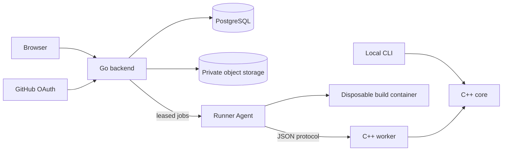
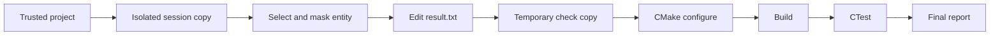
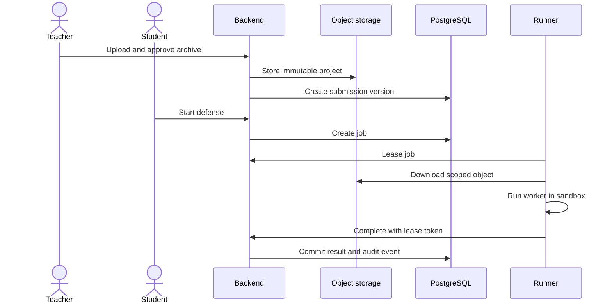
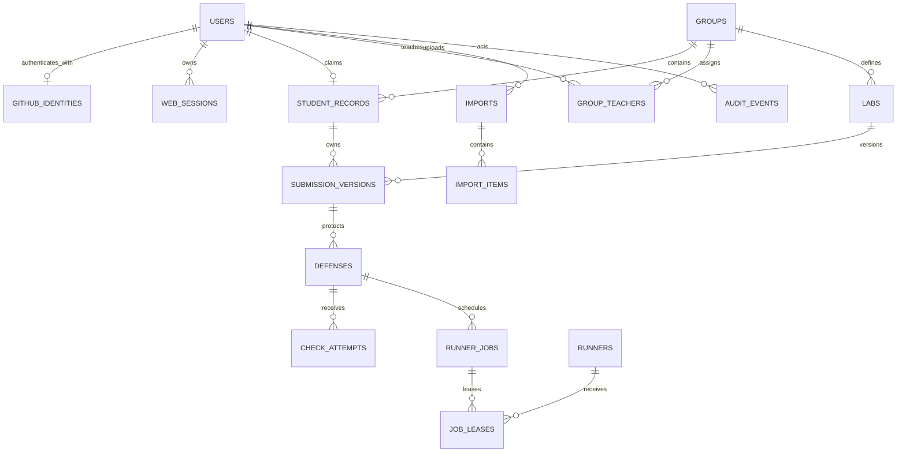
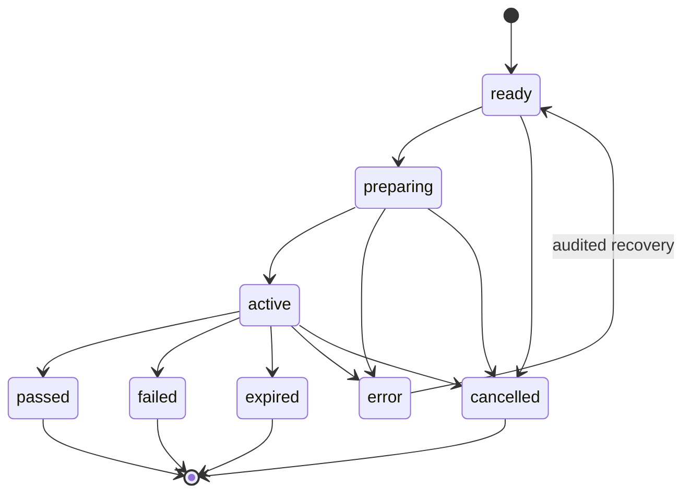
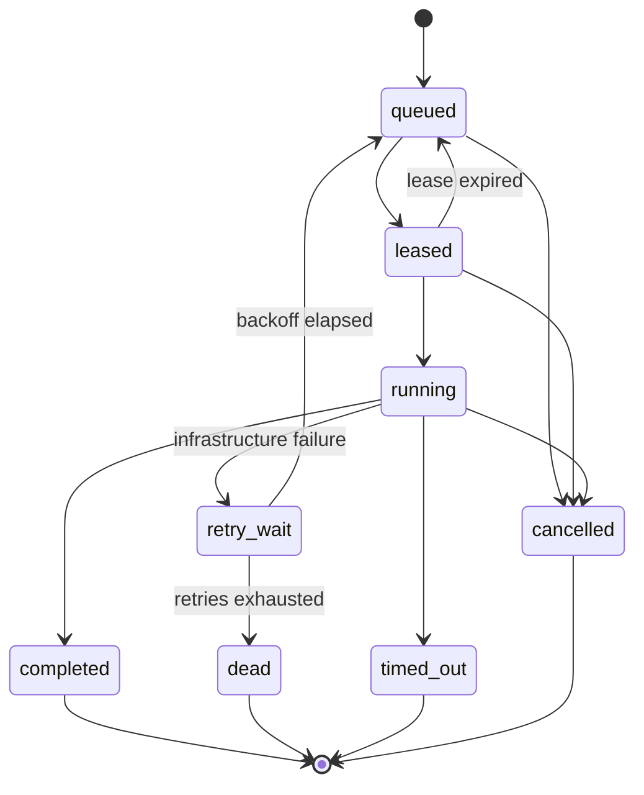
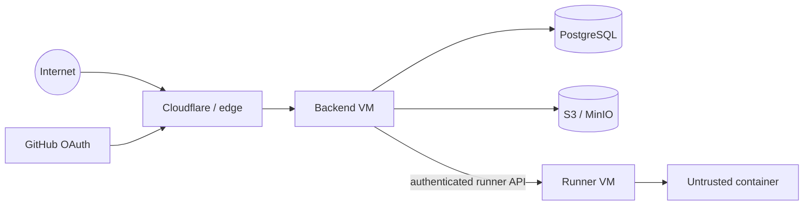

# Architecture

CppDefense has two execution modes: a local C++ CLI and a web platform built
around the same defense rules. The system favors a modular monolith and explicit
process boundaries over microservices.

## Components

- `cpp-defense-core` contains parsing, candidate selection, timing, and hashing.
  It has no CLI, JSON, database, or network dependencies.
- `application` implements the local defense workflow.
- `infrastructure` owns filesystem, workspace, parser, and process adapters.
- `cpp-defense` is the interactive terminal application.
- `cpp-defense-worker` exposes deterministic project operations over a versioned
  JSON stdin/stdout protocol.
- `backend` is a Go modular monolith for HTTP, authentication, imports,
  defenses, queue management, persistence, and the web UI.
- Runner Agent is a separate process on an isolated machine. It invokes the C++
  worker and executes untrusted builds inside disposable containers.
- PostgreSQL is the source of truth for metadata and state. Private S3-compatible
  storage holds archives and sanitized logs.

The versioned boundaries between the backend, runner, worker, and import tools
live in [`contracts/`](../contracts/README.md).

| Boundary | Responsibility | Trust level |
|---|---|---|
| C++ core | Parsing, selection, hashes, defense rules | Pure domain logic |
| Go backend | Identity, policy, orchestration, persistence | Trusted service |
| Runner | Lease execution and resource enforcement | Restricted service |
| Build container | Student CMake, compiler, and tests | Untrusted |
| PostgreSQL | Authoritative metadata and state | Private |
| Object storage | Immutable project bytes and safe logs | Private |

## Local defense flow

The original project is never modified. Each check uses a fresh temporary copy,
and the submitted answer replaces only the contents between the recorded outer
braces. Source hashes and byte offsets prevent applying an answer to changed
input.

Candidate selection is deterministic when a seed is supplied: the parser finds
supported entities, retains the largest `N`, and chooses one with a stable
64-bit random seed. The parser is intentionally lightweight and is not a full
C++ frontend.

## Web defense flow

1. A teacher uploads an archive for review.
2. The backend validates its manifest and ZIP structure before creating an
   immutable submission version.
3. A student starts a defense tied to one exact submission version.
4. PostgreSQL queues a preparation or check job and grants a time-limited lease
   to a runner.
5. The runner downloads the authorized object, invokes the worker, runs the
   project in a sandbox, and returns a bounded result.
6. The backend validates the lease and state transition before committing the
   result and audit event.

Retries are idempotent. A stale runner cannot overwrite a newer result, and a
new submission version never changes an active defense.

## Identity and authorization

GitHub OAuth with PKCE is the only login method. The numeric GitHub ID is the
stable external identity; the login is display and initial matching data.
Accounts require approval before normal access.

Roles are `student`, `teacher`, and `admin`. Role checks alone are insufficient:
every object query is scoped to the student record or teacher group. Browser
sessions use an opaque, hashed server-side token and CSRF protection. Runner
authentication is separate from user sessions.

## Logical data model

The diagram shows ownership and lifecycle relationships, not every physical
column or index.

| Entity | Important invariant |
|---|---|
| `users` | Active accounts have one role and a stable identity. |
| `student_records` | A record belongs to one group and is claimed by at most one user. |
| `submission_versions` | Student + lab versions are ordered and immutable. |
| `defenses` | A defense stays bound to the submission version it started with. |
| `check_attempts` | Attempts are append-only and evaluated against the deadline. |
| `runner_jobs` | Only the current valid lease can complete a job. |
| `audit_events` | Security-relevant mutations extend the hash chain. |

## Storage

Object keys contain a namespace, UUID, and extension—never a name, login, or
other personal data. The main namespaces are:

- `original-archives/` for teacher uploads;
- `normalized-submissions/` for immutable project versions;
- `safe-logs/` for bounded, sanitized runner output.

Writes calculate SHA-256 while streaming. Submission versions are immutable in
PostgreSQL, and identical content for the same student and lab is deduplicated.
The `reconcile-storage` command reports missing, orphaned, and mismatched objects
without deleting data.

| Value | Format | Secret |
|---|---|---|
| Domain, request, session, and job IDs | lowercase UUIDv7 | No |
| Lease token | 32 random bytes, unpadded base64url | Yes |
| Idempotency key | UUIDv4 or UUIDv7 | No |
| OAuth `state` and PKCE verifier | at least 32 random bytes, base64url | Yes, short-lived |
| Worker seed | unsigned 64-bit decimal string | No |
| SHA-256 in APIs | 64 lowercase hexadecimal characters | No |

## State and concurrency rules

Every transition is performed by one application command in a PostgreSQL
transaction. An unspecified transition is rejected as a conflict.

### Defense

### Runner job

| Event | Required checks |
|---|---|
| Start defense | Version exists; no conflicting active defense. |
| Accept attempt | Attempt was submitted before the deadline. |
| Lease job | Capacity exists; lease creation is atomic. |
| Complete job | Runner, token, lease expiry, job version, and state all match. |
| Retry job | Error is infrastructure-retryable and attempts remain. |
| Reopen defense | Create a new record linked to the immutable terminal defense. |

- Import, defense, user, and runner-job states change only through explicit
  transitions.
- Submission versions and completed defenses are immutable.
- Queue leases are atomic, time-limited, and bound to a hashed random token.
- Completion verifies the job, runner, lease, attempt, and expected state.
- Audit events form an append-only hash chain.
- Database migrations are forward-only, embedded in the backend binary, and
  protected by an advisory lock and stored checksum.

## Security boundaries

Browser input, archives, projects, OAuth data, and runner responses are
untrusted. ZIP extraction rejects traversal, links, devices, encrypted entries,
nested archives, path collisions, and configured resource-limit violations.

Student projects may execute arbitrary CMake and native code. Production checks
must therefore run on a separate machine in a disposable, non-root container
with no network, no service secrets, a read-only root filesystem, and strict
CPU, memory, process, disk, time, and log limits. Container isolation is not
treated as a perfect boundary.

| Risk | Mandatory control |
|---|---|
| Cross-user data access | Object-scoped authorization in service and SQL layers. |
| ZIP traversal or resource exhaustion | Canonical paths, entry restrictions, streaming limits, and quotas. |
| Stale or duplicate runner result | Atomic leases, hashed tokens, expiry, and idempotent completion. |
| Host compromise by student code | Separate runner machine and disposable hardened container. |
| Network or secret exfiltration | No container network, credentials, host mounts, or shared workspaces. |
| Object/database inconsistency | Content hashes, immutable versions, reconciliation, and restore tests. |
| Sensitive logs | Allowlisted structured metadata, truncation, redaction, and protected access. |

See [`SECURITY.md`](../SECURITY.md) for vulnerability reporting and operational
security requirements.
