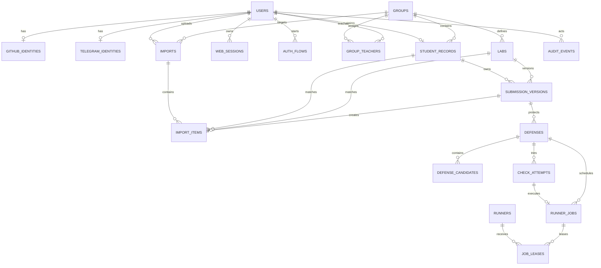

# ER-модель CppDefense 2.0

**Версия:** 1.0  
**Дата:** 2026-09-12  
**СУБД:** PostgreSQL 18

Документ фиксирует логическую модель. Физические миграции этапа 2 могут уточнить типы и индексы, но не должны ослаблять ограничения без нового ADR.

## Диаграмма

## Общие правила

- Первичные ключи доменных сущностей — UUIDv7, PostgreSQL type `uuid`.
- Время — `timestamptz` в UTC.
- Login/code — `citext` либо нормализованное lowercase-поле с уникальным индексом.
- SHA-256 — `bytea` длиной 32 байта в БД, lowercase hex в API.
- Денормализованные JSON-поля допустимы только для неизменяемых snapshot/diagnostic данных.
- Во всех изменяемых агрегатах есть `version bigint` для optimistic locking.
- Бизнес-удаление выполняется через status/`archived_at`; каскадное удаление результатов запрещено.

## Пользователи и вход

### `users`

| Поле | Тип | Ограничение |
|---|---|---|
| `id` | uuid | PK, UUIDv7 |
| `status` | enum | `pending`, `active`, `rejected`, `blocked` |
| `role` | enum nullable | `student`, `teacher`, `admin`; null только неактивному user |
| `display_name` | text nullable | не используется как идентификатор |
| `rejection_reason` | text nullable | обязателен при `rejected` |
| `blocked_at` | timestamptz nullable | обязателен при `blocked` |
| `created_at`, `updated_at` | timestamptz | not null |
| `version` | bigint | not null, >= 1 |

Ограничения:

- `active` требует ненулевую роль и минимум одну identity.
- `pending`/`rejected` не получают student endpoints.
- Блокировка не удаляет identities, но отзывает все sessions.

### `github_identities`

| Поле | Тип | Ограничение |
|---|---|---|
| `id` | uuid | PK |
| `user_id` | uuid | FK users, unique |
| `github_user_id` | bigint | unique, > 0, неизменяемый |
| `login` | citext | not null, display/matching only |
| `display_name`, `avatar_url` | text nullable | профиль |
| `verified_at`, `created_at`, `updated_at` | timestamptz | not null |

OAuth access/refresh token в этой таблице не хранится.

### `telegram_identities`

| Поле | Тип | Ограничение |
|---|---|---|
| `id` | uuid | PK |
| `user_id` | uuid | FK users, unique |
| `telegram_sub` | text | unique, not null |
| `username`, `display_name` | text nullable | профиль |
| `verified_at`, `created_at`, `updated_at` | timestamptz | not null |

### `auth_flows`

Короткоживущая запись OAuth/OIDC: `id`, `provider`, `state_hash`, `pkce_verifier_encrypted`, `nonce_hash`, `return_path`, `expires_at`, `consumed_at`. Одноразовое использование обеспечивается atomic update по `consumed_at is null`.

### `web_sessions`

`id`, `user_id`, `token_hash`, `csrf_secret_hash`, `view_as_role`, `view_as_target_id`, `created_at`, `last_seen_at`, `expires_at`, `revoked_at`. В cookie находится случайный raw token, в БД — только hash.

## Учебная структура

### `groups`

`id`, уникальный `code`, `name`, `is_demo`, `status(active|archived)`, timestamps, version.

### `group_teachers`

Составной unique `(group_id, teacher_user_id)`. User обязан иметь роль teacher/admin на момент назначения. Удаление назначения фиксируется audit.

### `student_records`

| Поле | Тип | Ограничение |
|---|---|---|
| `id` | uuid | PK |
| `group_id` | uuid | FK groups |
| `user_id` | uuid nullable | FK users, unique when not null |
| `github_login_expected` | citext | not null |
| `status` | enum | `unclaimed`, `claimed`, `archived` |
| `created_source` | enum | `manual`, `group_import` |
| timestamps/version | — | not null |

Ограничения:

- partial unique index на активный `github_login_expected`;
- `claimed` требует `user_id`, `unclaimed` требует null;
- student user связан не более чем с одной активной записью;
- смена login и user link всегда создаёт audit event.

### `labs`

`id`, `group_id`, `code`, `name`, `description`, `status`, `time_limit_seconds`, `top_n`, `check_config jsonb`, timestamps/version. Unique `(group_id, code)`. `time_limit_seconds > 0`, `top_n between 1 and 50`.

## Импорт и версии

### `imports`

`id`, `group_id`, `kind(group|lab)`, `state`, `uploaded_by`, `original_object_key`, `original_sha256`, `compressed_size`, `uncompressed_size`, `schema_version`, `reviewed_by`, `reviewed_at`, `reviewed_sha256`, `review_checklist jsonb`, `rejection_reason`, `error_code`, timestamps/version.

Ограничения:

- `reviewed_by/reviewed_at/reviewed_sha256` обязательны начиная с `approved`;
- `reviewed_sha256 = original_sha256` при применении;
- `completed`, `rejected`, `cancelled` терминальны;
- uploader/reviewer имеют доступ к target group.

### `import_items`

`id`, `import_id`, `student_record_id`, `lab_id`, `github_login_input`, `project_path`, `action`, `normalized_sha256`, `file_count`, `uncompressed_size`, `warnings jsonb`, `errors jsonb`, `submission_version_id`. Unique `(import_id, project_path)` и `(import_id, student_record_id, lab_id)` после matching.

### `submission_versions`

`id`, `student_record_id`, `lab_id`, `version_no`, `source(teacher_import)`, `original_import_id`, `normalized_object_key`, `normalized_sha256`, `source_manifest jsonb`, `created_at`, `created_by`. Unique `(student_record_id, lab_id, version_no)`. Archive/object неизменяемы после insert.

## Защиты и проверки

### `defenses`

`id`, уникальный `session_id`, `submission_version_id`, `status`, `mode(official)`, `seed` как uint64 decimal string, `time_limit_seconds`, `started_at`, `deadline_at`, `finished_at`, `current_draft`, `draft_version`, `selected_candidate_id`, `reopened_from_id`, `terminal_reason`, timestamps/version.

Ограничения:

- partial unique: одна defense в `ready|preparing|active` на submission version;
- `deadline_at = started_at + time_limit` для active/terminal started defense;
- terminal state требует `finished_at`;
- reopen требует `reopened_from_id` и audit reason.

### `defense_candidates`

`id`, `defense_id`, `rank`, `function_name`, `file_path`, byte offsets, line range, `line_count`, `source_sha256`, `original_body_sha256`, `is_selected`. Unique `(defense_id, rank)`, ровно один selected после подготовки.

### `check_attempts`

`id`, `defense_id`, `attempt_no`, `answer`, `answer_sha256`, `accepted_at`, `outcome(pending|passed|failed|error)`, `configure_result`, `build_result`, `ctest_result`, `finished_at`, `safe_log_object_key`, `manual_decision_id`. Unique `(defense_id, attempt_no)` и unique idempotency key в пределах defense.

### `runner_jobs`

`id`, `kind(prepare_defense|check_attempt)`, `defense_id`, nullable unique `check_attempt_id`, `state`, `priority`, `available_at`, `retry_count`, `max_retries`, `lease_owner_runner_id`, `lease_token_hash`, `lease_expires_at`, `timeout_seconds`, `worker_version`, `image_digest`, timestamps/version.

`prepare_defense` требует null attempt и создаёт candidates/selected function. `check_attempt` требует attempt и запускает materialization + CMake → Build → CTest.

Только infrastructure failure увеличивает `retry_count`. Compile/test failure завершает job и attempt без retry.

### `runners`

`id`, `name`, `status`, `slots`, `version`, `last_heartbeat_at`, `disabled_at`. Service credential хранится отдельно как hash/secret reference.

### `job_leases`

Append-only история: `id`, `job_id`, `runner_id`, `lease_no`, `token_fingerprint`, `leased_at`, `expires_at`, `released_at`, `release_reason`. Unique `(job_id, lease_no)`.

## Аудит

### `audit_events`

Append-only: `id`, `occurred_at`, `actor_user_id nullable`, `actor_kind(user|runner|system)`, `action`, `target_type`, `target_id`, `request_id`, `reason`, `metadata jsonb`, `prev_event_hash`, `event_hash`.

- Update/delete приложению запрещены DB grants.
- Metadata не содержит OAuth tokens, session tokens, полного кода или полного ответа.
- Hash chain помогает обнаружить изменение истории, но не заменяет внешнюю backup/экспортную защиту.

## Обязательные транзакции

1. **OAuth auto-link:** identity + user status/role + student record claim + audit.
2. **Manual link:** проверка прав + claim record + activate user + audit.
3. **Import apply:** проверка hash/review + создание всех versions/items + completed + audit; всё или ничего.
4. **Create attempt:** проверка deadline/no pending + attempt + job + idempotency record.
5. **Lease job:** lock eligible job + lease history + hashed lease token.
6. **Complete job:** verify current token/expiry + preparation or attempt result + defense transition + audit.
7. **Block user:** status + revoke all sessions + audit.

## Миграционный порядок

1. Extensions/types and UUID support.
2. Users, identities, auth flows, sessions.
3. Groups, teachers, student records, labs.
4. Imports, items, submission versions.
5. Defenses and candidates.
6. Runners, attempts, jobs and leases.
7. Audit append-only protections.
8. Indexes, partial uniqueness and foreign keys initially validated on clean DB.

Каждая migration имеет forward SQL и отдельную документированную recovery-операцию. Production downgrade schema не обещается; откат приложения выполняется только на совместимую миграцию либо через восстановление backup.
