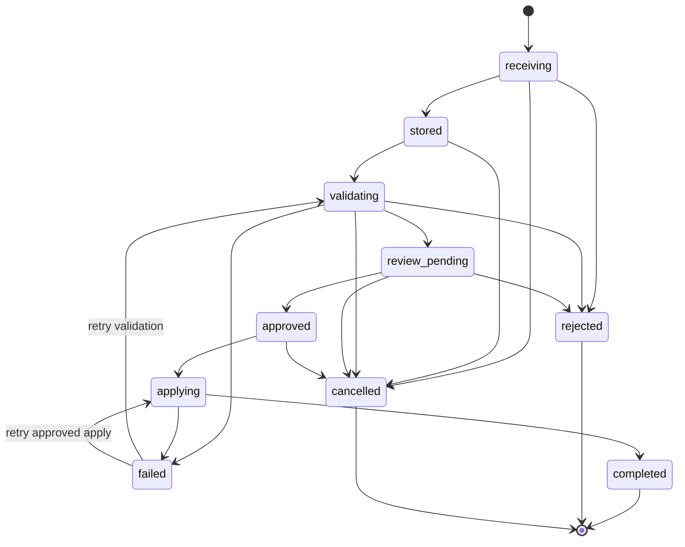
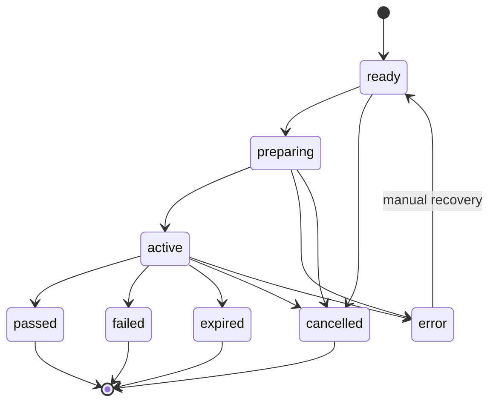
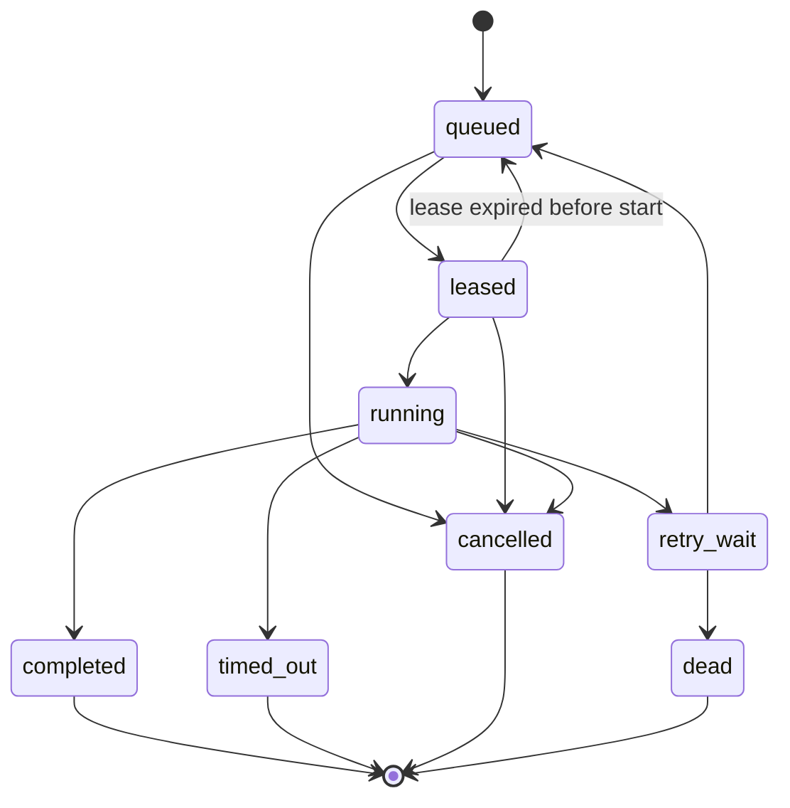
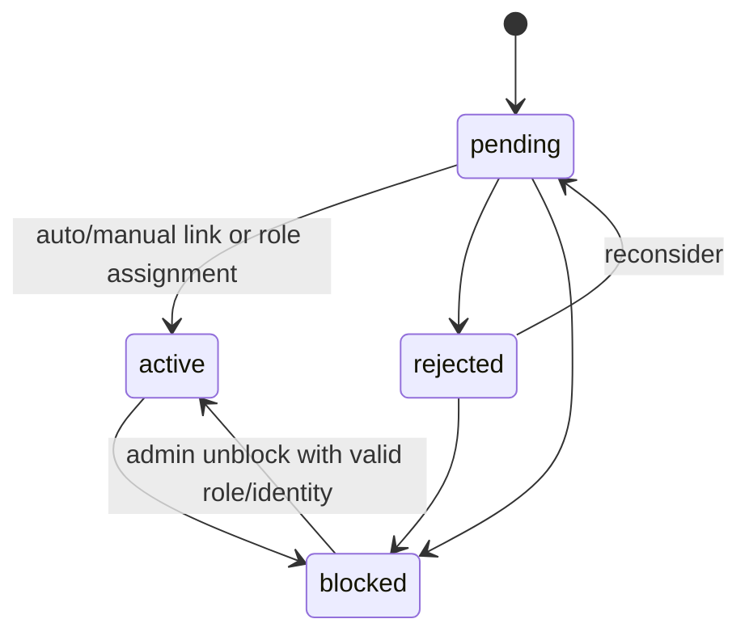

# Машины состояний CppDefense 2.0

**Версия:** 1.0  
**Источник:** требования 1.4

Каждый переход выполняется одной application-командой в транзакции PostgreSQL с optimistic version check и audit event. Неописанный переход запрещён и возвращает `409 INVALID_STATE_TRANSITION`.

## Импорт

| Из | Событие | В | Условия |
|---|---|---|---|
| `receiving` | upload completed | `stored` | size/hash/object committed |
| `receiving` | invalid/limit | `rejected` | safe rejection code |
| `stored` | validator starts | `validating` | lease/idempotent worker |
| `validating` | valid preview | `review_pending` | no blocking errors |
| `validating` | input violation | `rejected` | no versions created |
| `validating` | infrastructure error | `failed` | retryable code |
| `review_pending` | reviewer approves | `approved` | teacher group/admin, checklist, hash unchanged |
| `review_pending` | reviewer rejects | `rejected` | reason required |
| `approved` | apply starts | `applying` | current hash equals reviewed hash |
| `applying` | atomic commit | `completed` | all items created/skipped |
| `applying` | infrastructure rollback | `failed` | no partial versions |
| non-terminal | user cancels | `cancelled` | actor authorized |

`completed`, `rejected`, `cancelled` are terminal. Retry from `failed` resumes the failed phase; it cannot bypass review.

## Защита

| Из | Событие | В | Условия |
|---|---|---|---|
| `ready` | start confirmed | `preparing` | one active defense, version available |
| `preparing` | worker prepared | `active` | candidates + selected persisted, start/deadline set |
| `preparing` | unrecoverable preparation | `error` | structured reason |
| `active` | accepted attempt passed | `passed` | attempt accepted before deadline |
| `active` | student/teacher finishes | `failed` | no passed attempt, reason for teacher |
| `active` | deadline + no pending attempt | `expired` | no eligible pass |
| `active` | deadline + pending attempt fails | `expired` | wait for last timely attempt |
| non-terminal | cancel | `cancelled` | reason required for teacher/admin |
| `error` | authorized recovery | `ready` | new preparation run, audit required |

Terminal defenses are immutable. Reopen creates a new `ready` defense linked by `reopened_from_id`; it does not transition the old record.

## Runner job

| Из | Событие | В | Условия |
|---|---|---|---|
| `queued` | runner lease | `leased` | capacity, atomic lease token |
| `leased` | runner starts | `running` | current unexpired token |
| `leased` | lease expires | `queued` | retry/lease count allowed |
| `running` | worker/pipeline exits | `completed` | preparation result or attempt outcome; compile/test failure is completed |
| `running` | retryable infrastructure failure | `retry_wait` | retries remain |
| `retry_wait` | backoff elapsed | `queued` | available_at reached |
| `retry_wait` | retries exhausted | `dead` | attempt becomes error |
| `running` | wall timeout | `timed_out` | container killed and cleaned |
| eligible | cancellation | `cancelled` | no final result accepted later |

## Пользователь

- `active` requires a role and at least one identity.
- OAuth authentication and student record claim occur atomically.
- Blocking revokes all web sessions in the same transaction.
- Removing the last identity is forbidden.

## Инварианты конкуренции

- Import apply, create attempt, lease and complete use row locks/version checks.
- A stale HTTP command returns conflict and current representation; it never overwrites state.
- A stale runner token cannot heartbeat or complete a job.
- Idempotent retry returns the first committed resource/result.
- Deadline checks use PostgreSQL/Backend UTC time, never browser time.
