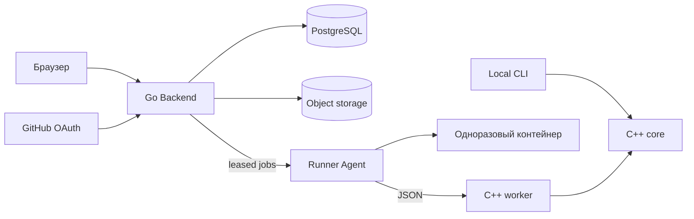
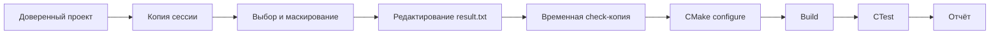
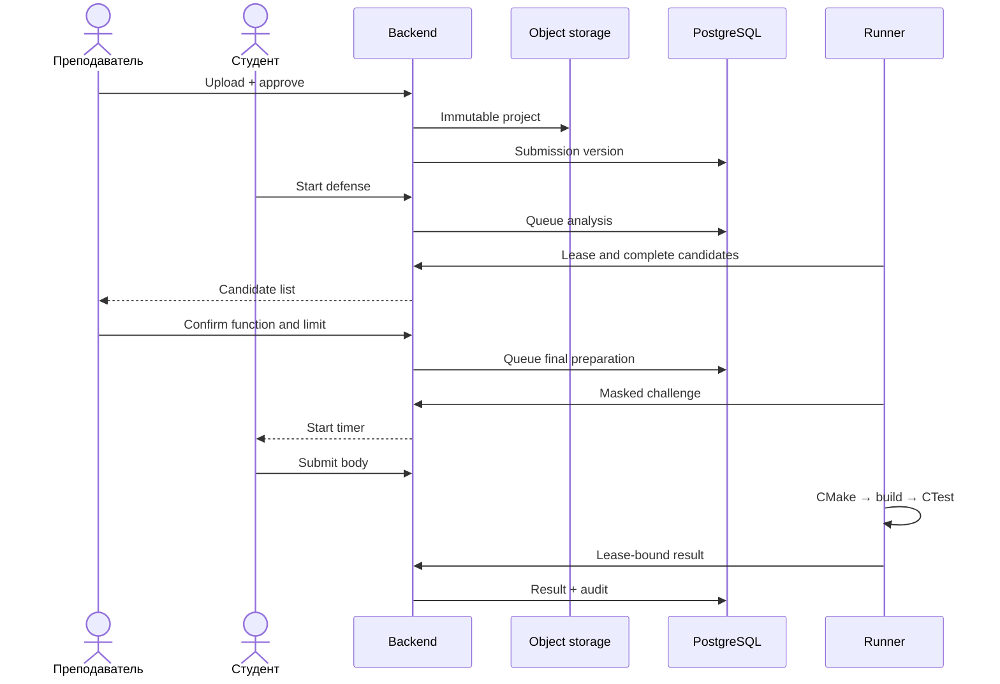
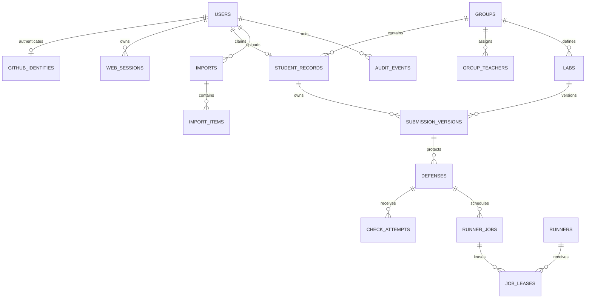
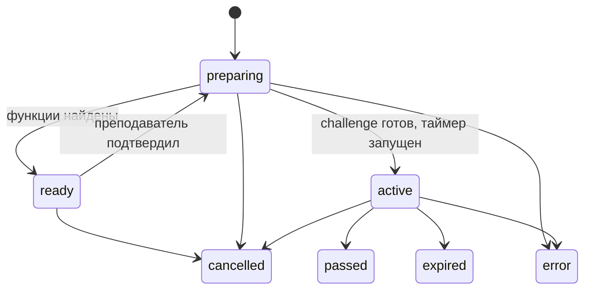
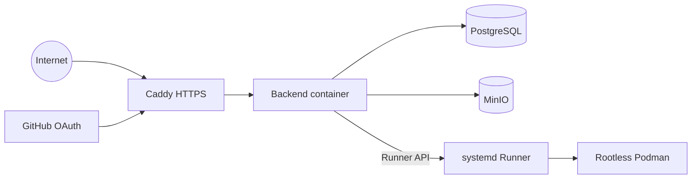

# Архитектура

[English](../ARCHITECTURE.md) | **Русский**

CppDefense работает в двух режимах: локальный C++ CLI и веб-платформа с теми
же правилами защиты. Это модульный монолит с явными границами процессов, а не
набор микросервисов.

## Компоненты

- `cpp-defense-core` — parsing, выбор кандидатов, таймер и hashes без CLI, JSON,
  БД и сети;
- `application` — локальные сценарии защиты;
- `infrastructure` — filesystem, workspace, parser и запуск процессов;
- `cpp-defense` — интерактивное консольное приложение;
- `cpp-defense-worker` — детерминированные операции над проектом через JSON;
- `backend` — Go-монолит: HTTP, OAuth, права, imports, defenses, queue, БД и UI;
- Runner Agent — отдельный процесс, вызывающий worker и rootless containers;
- PostgreSQL — источник истины по состояниям и результатам;
- приватное S3-хранилище — оригинальные и нормализованные архивы.

На текущем недорогом VPS Runner Agent находится на том же хосте. Более строгая
целевая схема переносит его на отдельную VM или машину.

| Граница | Ответственность | Доверие |
|---|---|---|
| C++ core | parsing, выбор, hashes, правила | чистая доменная логика |
| Go Backend | identity, policy, orchestration, persistence | доверенный сервис |
| Runner | lease и enforcement ресурсов | ограниченный сервис |
| Build container | CMake, compiler и тесты студента | недоверенный |
| PostgreSQL | основное состояние | приватный |
| Object storage | неизменяемые bytes проектов | приватный |

Версионируемые границы находятся в [`contracts/`](../../contracts/README.ru.md).

## Локальная защита

Оригинал не меняется. Каждая попытка получает свежую копию, а ответ заменяет
только bytes между сохранёнными внешними скобками. SHA-256 и offsets не дают
применить ответ к изменившемуся исходнику.

При заданном 64-bit seed выбор воспроизводим. Перед защитой преподаватель
выбирает режим «только функции» или «функции, классы и структуры» и колесо из
2–12 секторов. В автоматическом режиме тестовые файлы исключены, около двух
третей колеса составляют крупнейшие сущности, а треть — детерминированно
случайные. В ручном режиме выбранная преподавателем сущность фиксируется как
победитель и может находиться в тестовом файле. Parser намеренно лёгкий и не
заменяет полноценный frontend компилятора.

## Веб-защита

1. Преподаватель загружает архив на review.
2. Backend проверяет manifest и ZIP, затем создаёт неизменяемую версию работы.
3. Студент запускает защиту этой версии.
4. PostgreSQL ставит анализ в очередь; Runner возвращает каталог сущностей.
5. Преподаватель выбирает режим, сущности, 1–30 минут и 2–12 секторов. В
   ручном режиме доступен просмотр всего проекта.
6. Вторая подготовка маскирует выбранное тело. Только после неё запускается
   таймер и открывается repository browser.
7. Check job вставляет ответ в sandbox-копию и возвращает отдельные результаты
   configure, build и CTest.

Повторы идемпотентны: старый lease не может перезаписать новый результат, а
новая версия загрузки не изменяет уже начатую защиту.

## Identity и права

Единственный вход — GitHub OAuth с PKCE. Стабильным внешним identity является
числовой GitHub ID; login используется для отображения и начального matching.
До подтверждения пользователь остаётся `pending`.

Роли: `student`, `teacher`, `admin`. Одной роли недостаточно: SQL-запросы также
ограничивают объект student record или группой преподавателя. Browser session
имеет непрозрачный hashed token и CSRF. Runner использует отдельный service
credential.

## Данные и инварианты

| Entity | Инвариант |
|---|---|
| `users` | активный аккаунт имеет одну роль и стабильный identity |
| `student_records` | одна группа, не более одного привязанного user |
| `submission_versions` | нумеруются и не изменяются |
| `defenses` | всегда привязана к исходной submission version |
| `check_attempts` | append-only и проверяются относительно deadline |
| `runner_jobs` | завершает только текущий валидный lease |
| `audit_events` | важные изменения продолжают hash chain |

Object keys содержат namespace, UUID и extension, но не ФИО и login:
`original-archives/` хранит uploads, `normalized-submissions/` — версии.
Ограниченные результаты компиляции находятся в PostgreSQL. Запись считает
SHA-256 в потоке, одинаковый content одной lab/student дедуплицируется, а
`reconcile-storage` только сообщает расхождения.

UUID — lowercase UUIDv7; lease token и OAuth verifier секретны; worker seed
передаётся unsigned decimal string; SHA-256 — 64 lowercase hex symbols.

## Состояния и конкуренция

Каждый переход выполняется одной транзакционной командой. Неописанный переход
возвращает conflict.

Runner job проходит `queued → leased → running → completed`. Истёкший lease
может вернуть job в очередь, временная ошибка — в `retry_wait`, а исчерпанные
повторы — в `dead`. Lease создаётся атомарно, ограничен временем и связан с
hash случайного token. Completion проверяет job, runner, lease, attempt и
ожидаемое состояние. Миграции выполняются вперёд под advisory lock и checksum.

## Границы безопасности

Текущая небольшая схема — один Ubuntu VPS:

PostgreSQL, MinIO и Backend доступны только на loopback. Архивы, browser input,
OAuth data и ответы runner недоверенные. ZIP extraction запрещает traversal,
links, devices, encryption, nested ZIP, collisions и превышение limits.

Student CMake и binaries — произвольный native code. Контейнер не имеет сети и
секретов, использует read-only root и limits CPU/RAM/PID/disk/time/log. Но один
VPS означает общее ядро, поэтому container escape затронет application host.
Для более серьёзной публичной эксплуатации runner обязателен на отдельном хосте.

| Риск | Контроль |
|---|---|
| доступ между студентами | object-scoped authorization в service и SQL |
| ZIP Slip/исчерпание ресурсов | canonical paths, ограничения entry и quotas |
| stale/duplicate result | atomic lease, hash token, expiry, idempotency |
| compromise хоста | hardened container сейчас, отдельный runner далее |
| network/secret exfiltration | no network, credentials и общих workspaces |
| несогласованность DB/object | hashes, immutable versions, reconcile, restore |
| чувствительные логи | allowlist, truncation, redaction и закрытый доступ |

См. [политику безопасности](../../SECURITY.ru.md).
